# Http Web Server Library written in C

이 라이브러리는 Http 프로토콜을 지원하는 http web server 입니다.   
   
이 라이브러리는 다음과 같은 특징을 가집니다.
- http/1.1 스펙에서 설계되었습니다.
- 웹서버 ↔ 라우터 구조를 가집니다.
- http 프로토콜만 지원합니다.
- Json 파서는 아직 불완전합니다. (#195)
- realloc 으로 구현한 가변 길이 배열 구현체가 포함되어있습니다. 다양한 타입을 지원합니다.
- 스레드 기반 비동기 서버입니다.
- `DEBUG` 매크로가 선언되었을 시에만 작동하는 디버그 로그를 제공합니다.

# documents
- 코드 베이스 문서들은 <https://sony-string.net/GDB-Online-Clone/Http-Web-Server-C/> 여기서 확인하실 수 있습니다.

# How to build

## Prerequirement
다음과 같은 버전에서 빌드가 됨을 확인하였습니다.   
해당 프로젝트는 시스템 간 호환성이 좋지 못한 점이 있습니다.
```bash
gcc (Ubuntu 13.2.0-23ubuntu4) 13.2.

Distributor ID: Ubuntu
Description:    Ubuntu 24.04.1 LTS
Release:        24.04
Codename:       noble

5.15.167.4-microsoft-standard-WSL2 # 네이티브 Ubuntu 24.04 의 기본 커널에서도 문제 없을 것으로 생각됩니다
```

## 라이브러리 빌드
빌드하기 위해 우선 프로젝트를 클론합니다.   
```bash
git clone https://github.com/GDB-Online-Clone/http_web_server_c
```
   
웹서버 라이브러리를 빌드하기 위해서는 `http_web_server_c` 디렉토리에서 진행합니다.   
해당 디렉토리에서 `make` 를 실행하면 됩니다.
```bash
cd http_web_server_c
make
```
   
기본적으로 코드에는 디버깅 심볼과 디버그 로그가 포함되어있습니다.   
이를 제거하기 위해서는 다음과 같이 입력합니다.
```bash
make ADD=
```
   
다른 컴파일 옵션을 지정하고 싶다면 `ADD` 에 원하는 컴파일 옵션을 입력할 수 있습니다.
```bash
make ADD="Wall -DMACRO"
```

## GDB Online Clone 빌드
먼저 위의 라이브러리 빌드를 진행해야 합니다.   
이후 `gdbc` 디렉토리로 이동하여 빌드합니다.
```bash
cd gdbc
make ADD=
```
이 경우에도 동일하게 `ADD` 옵션이 있습니다.   
`make` 가 완료되었다면, `gdbc/gdb-online-clone` 이 생성됩니다.

## GDB Online Clone 서버 실행
```bash
./gdb-online-clone
```

## 예기치 못한 서버 종료 시
아래의 명령어로 좀비 프로세스를 제거할 수 있습니다.
```bash
pkill bins/[0-9]\+.out
```

## GDB Online Clone 설정 방법
- 컴파일 시에 소스코드에서 설정을 해주고 빌드를 해야 합니다.
**`[gdbc/src/main.c:642]`**: 로컬 변수 `app` 에 서버와 관련한 설정이 있습니다.
```c
.route_table        // 라우트의 테이블입니다. 엔드포인트 및 해당하는 콜백함수들이 저장되어 있습니다. 
.port_num           // 서버가 listen 하는 포트 번호입니다.
.backlog            // listen() 의 backlog 사이즈입니다.
.threadpool_size    // 스레드 풀의 스레드 개수입니다. 이 값은 머신에 따라서 최적값이 변화할 수 있습니다.
```

**`[gdbc/src/service.c:642]`**: 매크로 `MAX_PROCESS` 또한 중요한 설정입니다.
- 서버가 수용 가능한 동시에 실행하는 프로세스 실행 요청입니다.
- 예를 들어 *4096* 으로 설정되어있다면, 4096개의 실행 중은 프로세스가 있을 시 새로운 프로세스를 실행 요청을 수용할 수 없습니다.
- 제 머신에서는 4096 이 최대였습니다.

# GDB Online Clone 사용 방법 
### 해당 디렉토리는 정적 파일을 포함하고 있지 않습니다.
따라서 정적 파일을 다운로드 받아야 합니다.
```bash
git clone https://github.com/GDB-Online-Clone/ide/ --branch feature/gdb
```
### 실행 줄 인자
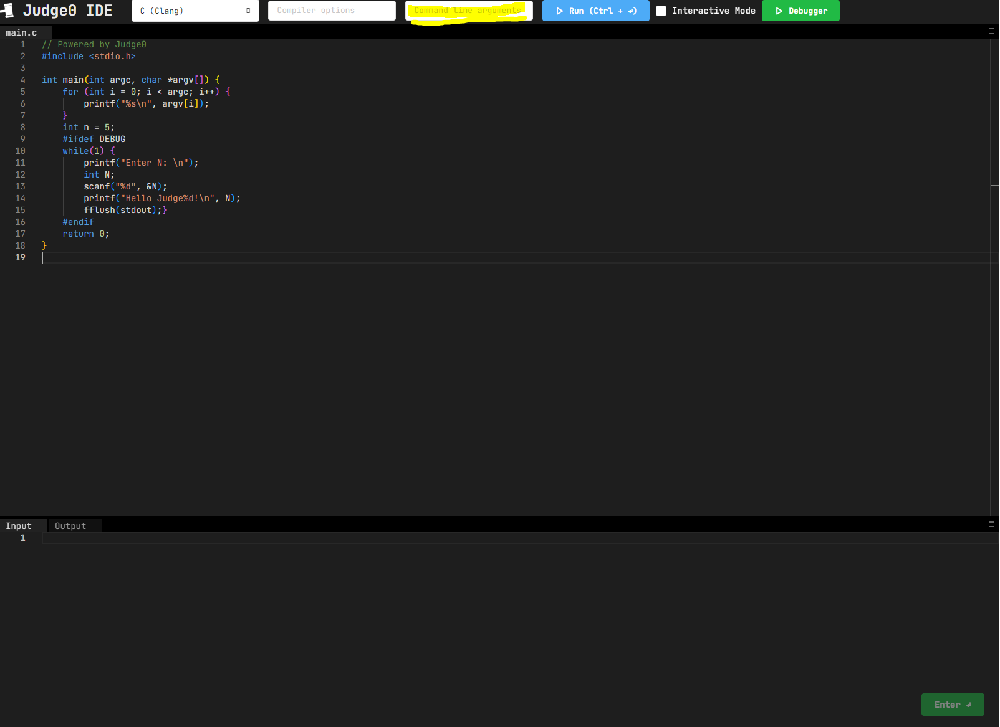

### 컴파일 옵션
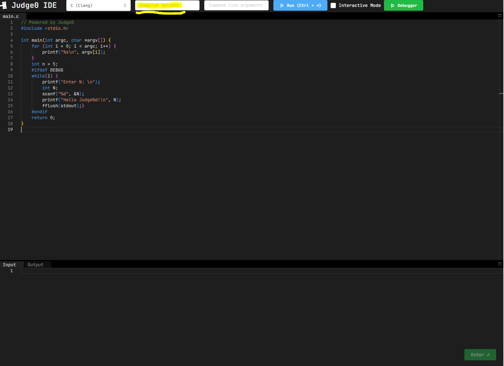

### 컴파일러 및 언어 선택
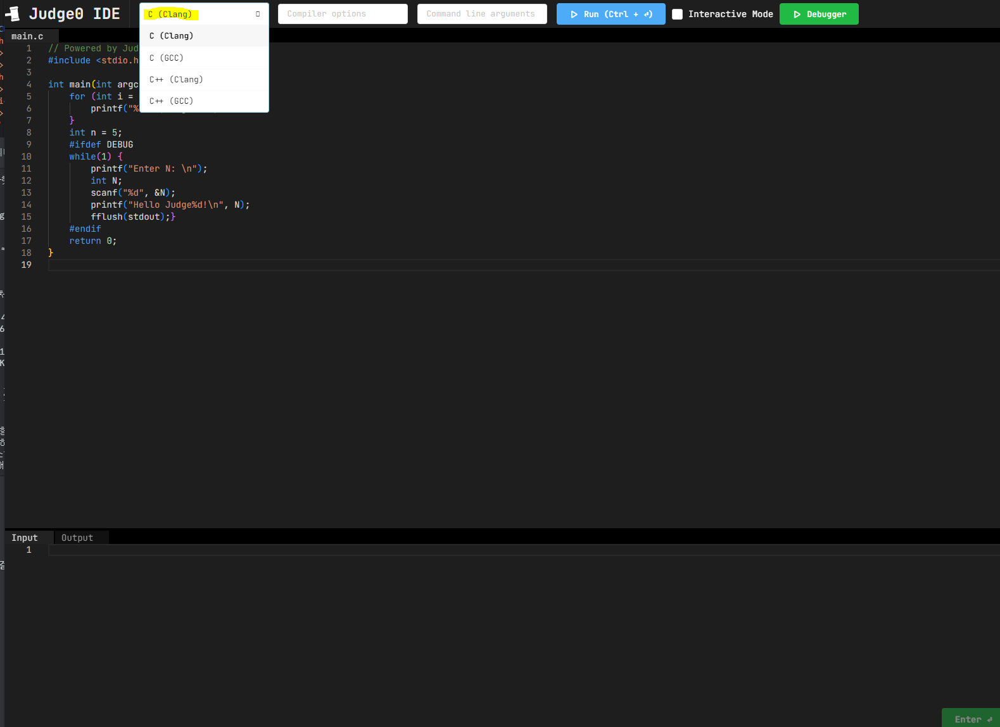

### 드래그
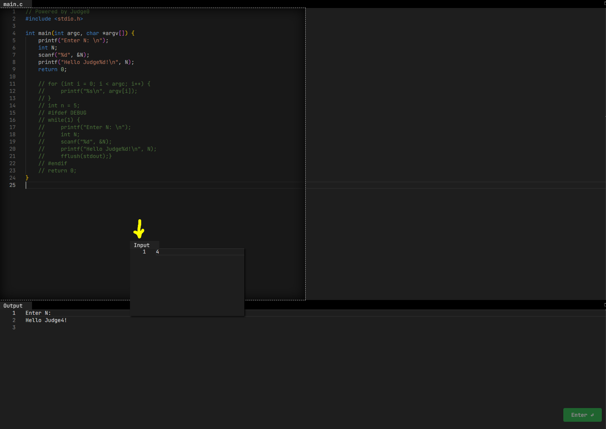

### 입력 데이터 작성
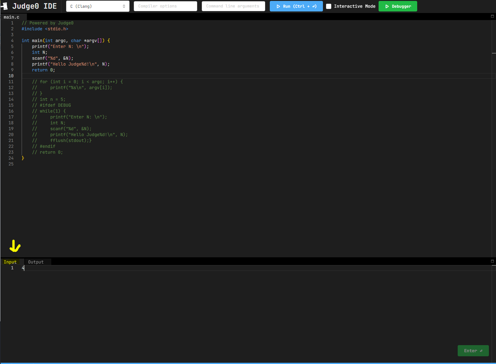

### 실행
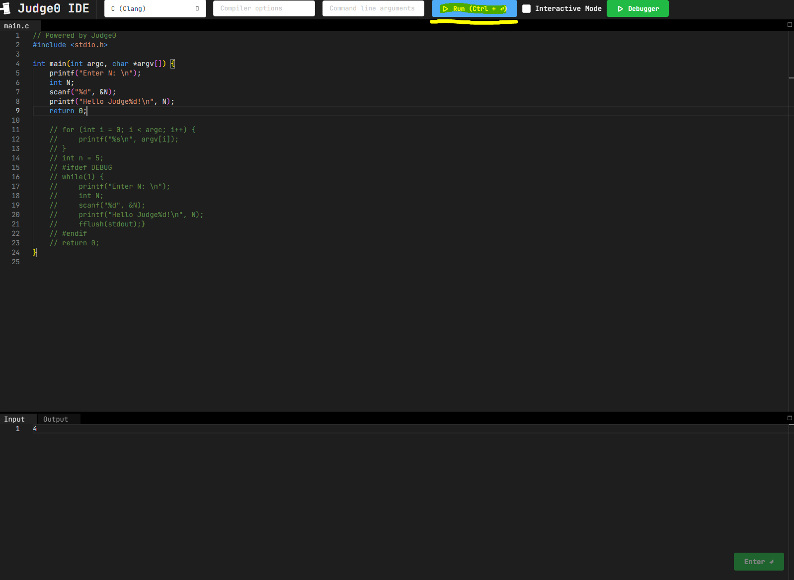

### 출력 데이터
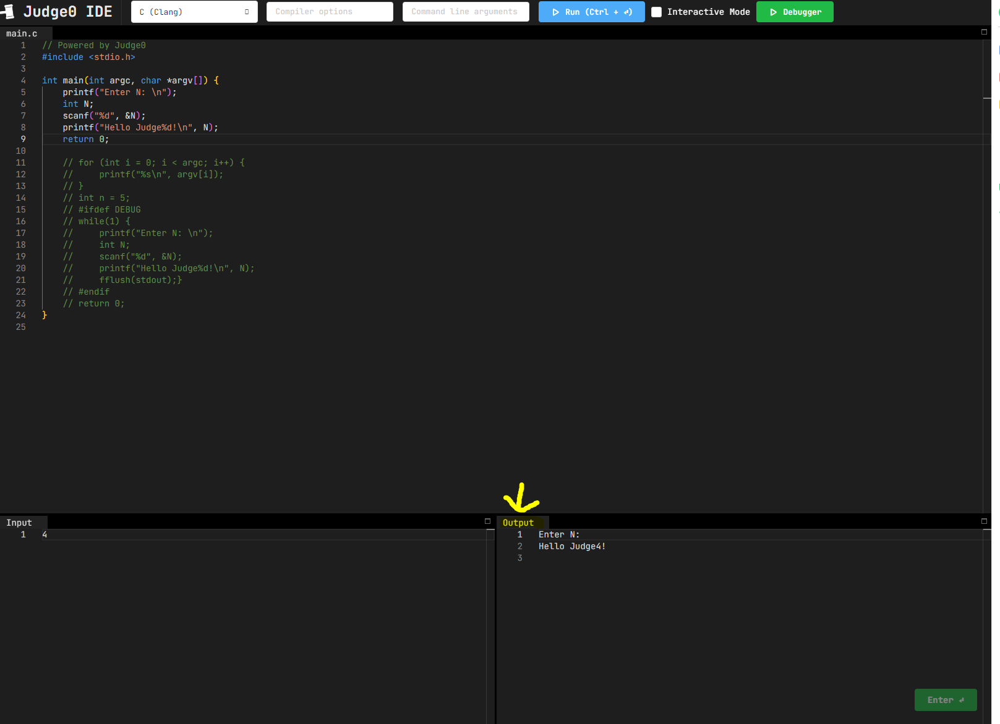

### 인터렉티브 모드 (실행 중 입력 가능 모드)
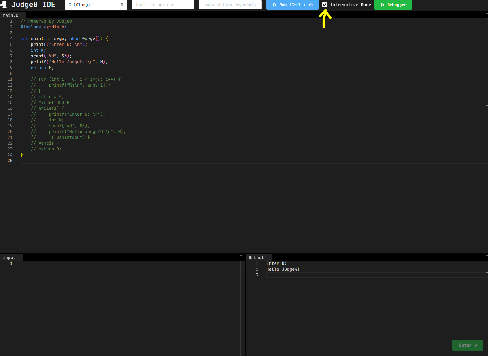   
해당 체크박스를 체크하고 실행하면 됩니다.

### 인터렉티브 모드에서의 입력 방법
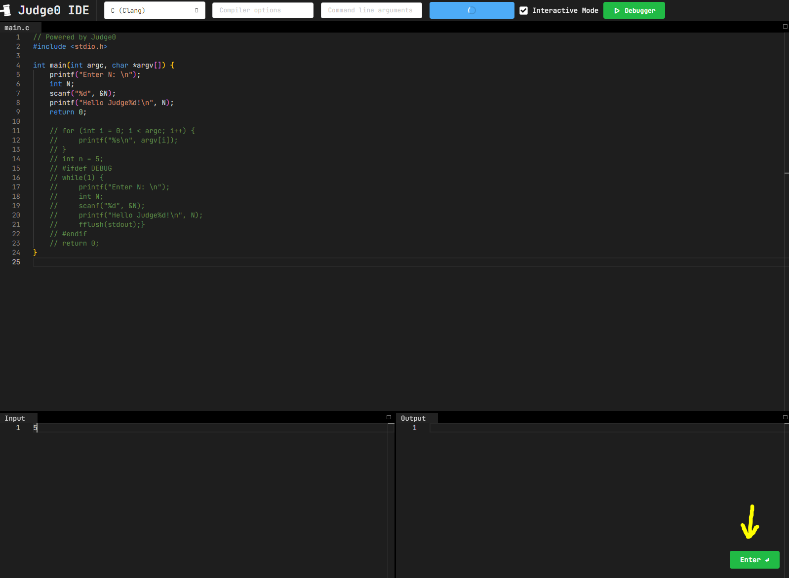   
입력 데이터 폼에서 입력 후, **화면에 보이는** `Enter` 버튼을 누르면 됩니다.

### 프로그램 정지
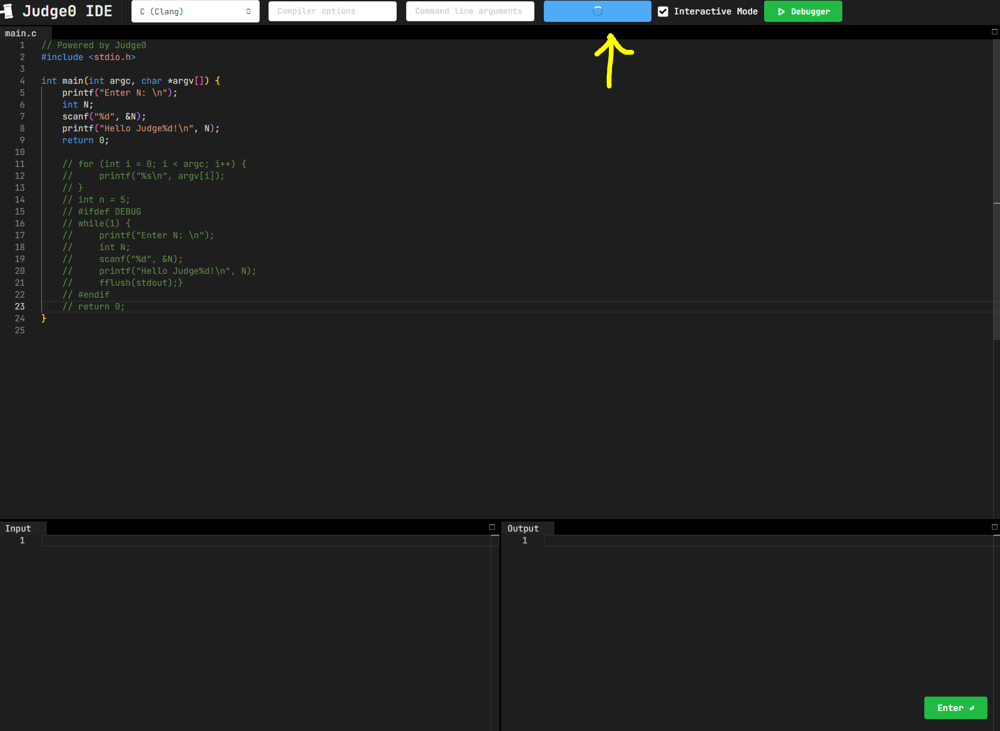

### gdb 실행
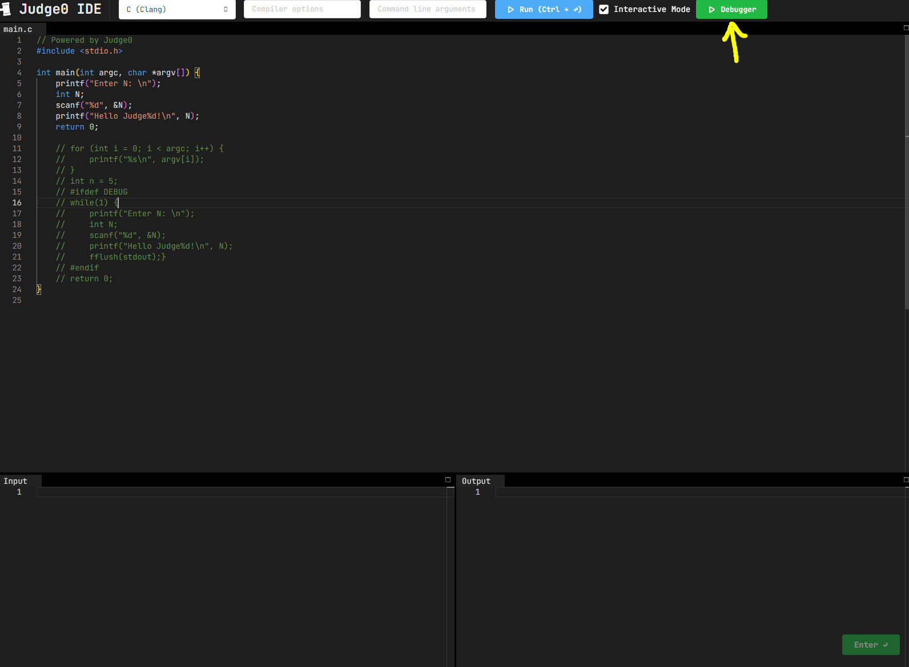
이후 인터렉티브와 동일합니다.
   
# 부하 테스트 방법
### `gdbc/test/README.md` 를 참고해주세요.
   
# 구현 상 특이점
- 메인 스레드를 제외한, 다른 스레드는 스레드 풀에서 관리합니다.
- 스레드 풀은 `작업 큐` 에 새로운 작업이 들어올 때 까지 대기합니다.
- 스레드 간 통신은 `pthread_cond_signal` 시그널을 이용합니다.
- 스레드 사이 동기화는 [`_Atomic`](https://en.cppreference.com/w/c/atomic) 에서 제공하는 방식과, `mutex lock` 을 이용하였습니다.
- 컴파일 요청 및 실행은 `fork-exec` 과 `posix_spawn` 으로 실행됩니다.
- 실행 요청 받은 프로그램과의 IPC 는 `pipe` 를 통해 구현되었습니다.
- 모든 JSON http request body 를 파싱할 수 있는 것은 아닙니다. (#195)
- RESTful 한 응답 코드는 아니고 어느 정도 자의적으로 응답 코드를 부여하였습니다.
- 대부분의 로그는 컴파일 시 `-DDEBUG` 옵션을 주면 표준 출력으로 볼 수 있습니다.